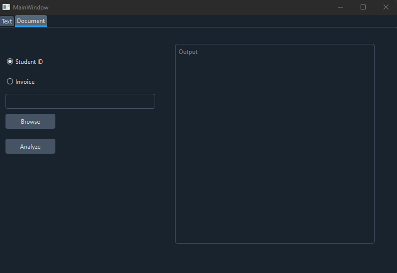

## Lab 4. Custom Extraction Document Intelligence + Zad 1. - Wyodrębnienie danych z faktury

### 1. Opis wykonaje pracy
Custom Extraction został wytrenowany na  zdjęciach legitymacji studenckich (5 zdjęć).

W trakcie odczytywania danych z faktur przeprowadzana jest weryfikacja czy suma przedmiotów na fakturze jest równa sumie
zapisanej na fakturze (przed opodatkowaniem)

### 2. GUI
Do programu zostało zaimplementowane proste GUI w QT pozwalające na
wybranie typu analizowanego dokumentu i wskazanie pliku. 


### 3. Przykład działania
Dla przykładowej faktury z pliku invoice.png wynik działania zawarty jest w pliku
result_invoice.json

Dla przykładowej legitymacji z pliku student_id_card.png wynik działania zawarty jest w pliku 
result_student.json


### 4. Kod programu

Wczytanie zmiennych środowiskowych, inicjalizacja Clienta analizy dokumentowej:
```python
endpoint = os.getenv("FORM_RECOGNIZER_ENDPOINT")
key = os.getenv("FORM_RECOGNIZER_KEY")
custom_model_id = "student_id"

document_analysis_client = DocumentAnalysisClient(endpoint, AzureKeyCredential(key))
```

Analiza legitymacji studenckich:
```python
def analyze_student_id(file_path):
    with open(file_path, "rb") as file:
        poller = document_analysis_client.begin_analyze_document(model_id=custom_model_id, document=file)
        result = poller.result()

    student_id_data = {}
    for document in result.documents:
        for field_name in document.fields:
            field = document.fields[field_name]
            student_id_data[field_name] = {
                "value": field.value,
                "confidence": field.confidence
            }
    return student_id_data
```

Analiza faktur:
```python
def analyze_invoice(file_path):
    with open(file_path, "rb") as file:
        poller = document_analysis_client.begin_analyze_document("prebuilt-invoice", document=file)
        result = poller.result()
    total_amount = None
    line_item_prices = []
    invoice_data = {}  # Dictionary to collect and return results

    for document in result.documents:
        for field_name in document.fields:
            field = document.fields[field_name]
            if field_name == "SubTotal":
                total_amount = field.value.amount
                invoice_data["SubTotal"] = {
                    "value": total_amount,
                    "confidence": field.confidence
                }
            elif field_name == "Items":
                if field.value:
                    line_items = []
                    for item in field.value:
                        line_item_data = {
                            "Description": item.value.get("Description").value,
                            "Amount": item.value.get("Amount").value
                        }
                        line_items.append(line_item_data)
                        price_field = item.value.get("Amount")  # Extract the price of each line item
                        if price_field and price_field.value is not None:
                            line_item_prices.append(price_field.value.amount)

                    invoice_data["Items"] = line_items
            else:
                invoice_data[field_name] = {
                    "value": field.value,
                    "confidence": field.confidence
                }

    # Calculate the sum of line item prices
    calculated_total = sum(line_item_prices)
    total_validation = {
        "CalculatedTotal": calculated_total,
        "MatchesExtractedTotal": abs(calculated_total - total_amount) < 0.01 if total_amount else None
    }
    invoice_data["TotalValidation"] = total_validation
    return invoice_data

```